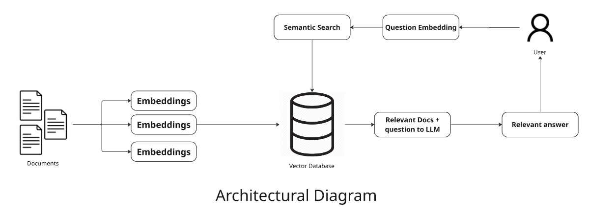
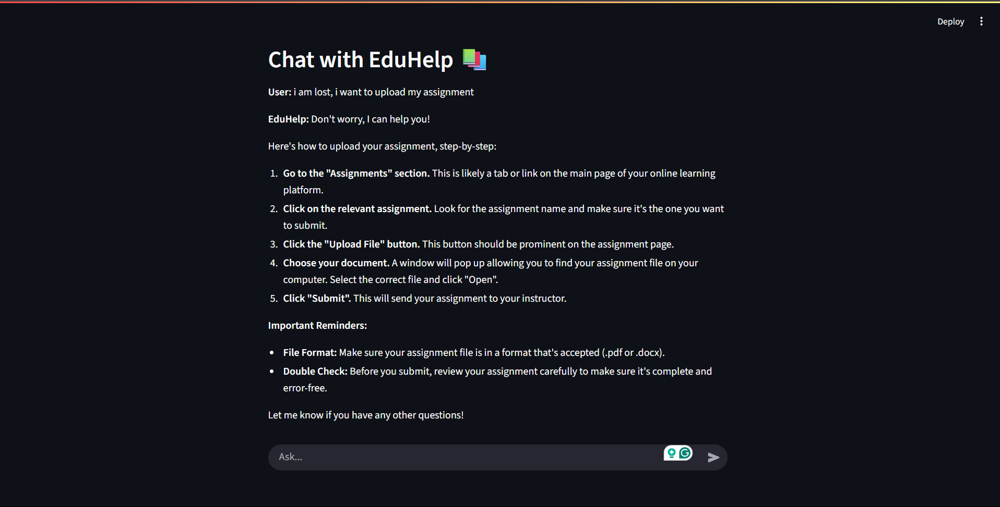

# EduHelp – AI Assistant for Learning Portal 

## Introduction
EduHelp is a simple AI assistant built using LangGraph, LangChain, and Streamlit to help students navigate an online learning platform. It supports natural queries like "I'm lost trying to submit my assignment" by retrieving relevant help documents using vector embeddings and providing intelligent responses via an LLM backend.

## How It Works

### Help Document Ingestion and Embedding
The system begins by reading a set of pre-defined help documents (.txt files) stored locally in a help_docs folder.  
Each document is processed using the SentenceTransformer model (all-MiniLM-L6-v2) to convert its text into a high-dimensional vector embedding. This embedding represents the semantic meaning of the document.  
These vector embeddings are stored in a vector database using ChromaDB, enabling fast and accurate similarity-based retrieval.  
### User Query Handling
When the user submits a question (e.g., “I’m lost trying to submit my assignment”), the query is also converted into an embedding using the same SentenceTransformer.  
This query embedding is then used to perform semantic search in the vector database.  
A prompt is constructed and passed to the LLM.  
The application maintains a short-term memory of the last 3 exchanges in a session using LangGraph’s MemorySaver.  
### Retrieval of Relevant Documents
The top most relevant documents are retrieved from the vector database based on the similarity of their embeddings to the query.  
These documents are used as context for the language model to generate an accurate and helpful response. 
The documents retrieved are shown in the backend
### User Interface
The frontend is built using Streamlit, offering a clean and interactive chat UI.  
Users can type their questions in a chat-style input box.  
Responses from the assistant are displayed in real-time. 

<video controls src="EduHelp.mp4" title="Title"></video>

## User Interface

## Tech Stack Used
Frontend - Streamlit  
Backend - Langchain, Langgraph  
LLM - Gemma-2-9b-it (Groq)  
Embeddings - Sentence-Transformers (all-MiniLM-L6-v2)  
Vector DB - ChromaDB  
Python 3.13  

